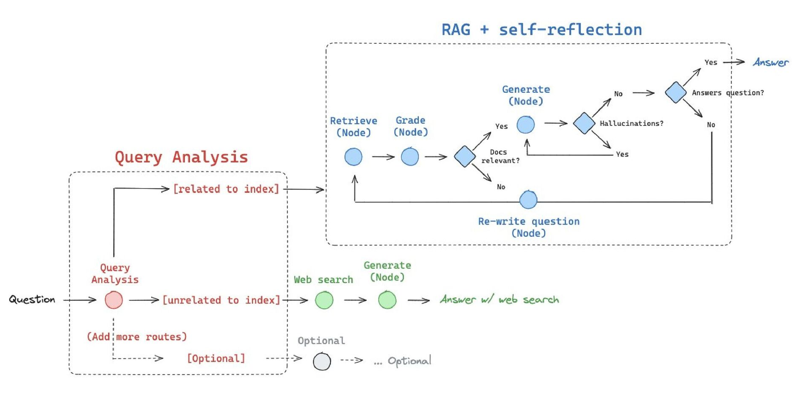

# Advanced RAG + Self-Reflection: Query Analysis Workflow

Retrieval-Augmented Generation (RAG), büyük dil modellerinin (LLM - Large Language Models) daha anlamlı ve doğru yanıtlar verebilmesi için bir bilgi getirme (retrieval) mekanizmasını metin üretimi (generation) ile birleştiren bir yapay zeka mimarisidir.

Normalde, LLM'ler sadece kendi eğitim verisiyle sınırlı bilgi sağlarken, RAG sayesinde model, dışarıdan (PDF, veri tabanı, web sayfası vb.) belge alarak daha kanıt dayalı ve isabetli cevaplar verebilir.

> Örneğin: Sadece GPT-4'e "Türkiye'nin güncel nüfusu nedir?" derseniz doğru bir yanıt veremeyebilir, çünkü eğitim verisi geçmişte kalmıştır. Ama RAG sistemi bu soruda TÜİK gibi güncel bir kaynaktan bilgi çekerek doğru veriyi sunabilir.

Self-reflection ise bu mekanizmayı daha da güçlendirir: Model cevabını oluşturduktan sonra kendine şu soruları sorar:
- Gerçekten kaynaklardan alıntı mı yaptım?
- Cevabım yeterince açık mı?
- Uydurma bilgi içeriyor muyum?

Bu sayede çıktı kalitesi önemli ölçüde artar.

---

## 🔢 1. Query Analysis (Sorgu Analizi)

### ✏️ Amaç:
Kullanıcıdan gelen sorunun hangi yolla işleneceğini belirlemek. Elimizdeki veri indeksleri bu soruya cevap verebiliyor mu, yoksa web aramasına mı çıkmak gerekiyor?

### 🔍 Nasıl işler?
1. Kullanıcı bir soru sorar: "GPT modelleri ile RAG arasındaki fark nedir?"
2. Bu soru Query Analysis modülüne gelir.
3. Bu modül soruyu anlamaya çalışır:
   - 🔴 Anahtar kelimeler: "GPT", "RAG", "fark"
   - 🤖 Bu kelimeler sistemin indekslediği teknik belgelerde mevcut mu?
4. Bu kontrol sonrası iki olasılık doğar:
   - ✅ **[Related to index]**: Soruya yanıt verebilecek belgeler sistemde vardır. RAG + Self-reflection hattına yönlendirilir.
   - ❌ **[Unrelated to index]**: Sistem bu soruya dair hiçbir belgi barındırmıyor. Bu durumda web search hattı devreye girer.
5. 🔁 (Opsiyonel) Gelişmiş sistemlerde Query Analysis Node, soruyu daha iyi yönlendirmek için ön işlemden geçirir: yeniden yazma, keyword çıkarımı, hatta kullanıcı niyeti sınıflandırması (intent classification).

### 🧵 Detaylı Senaryo:
> Soru: "2025 yılında en verimli yapay zeka modeli hangisi?"
- Query Analysis modülü bu sorunun teknik bir karşılığı olup olmadığını indekslerde kontrol eder.
- Eğer eğitim setlerinde 2025'e dair bilgi yoksa: `unrelated to index`
- Web search modülüne yönlendirilir.

---

## 🧠 2. RAG + Self-Reflection (Yansımalı Bilgi Getirme)

### 📄 Amaç:
Kapsamlı ve kaliteli cevap üretimi için ilgili belgeleri getir, değerlendir, cevap oluştur ve çıkan sonucu tekrar gözden geçirerek gerekirse yeniden dene.

### 🔷 Detaylı Adımlar:

#### ● 1. Retrieve (Node) → "Belgeleri getir"
- Sistem, kullanıcının sorusunu vektör formatına dönüştürür (embedding).
- Bu vektör, Chroma, Pinecone, FAISS gibi bir vektör veritabanında aratılır.
- En alakalı (top-k) belgeler getirilir.
- Örnek: Soru "RAG mimarisi nedir?" → En alakalı 5 belge çekilir.

#### ● 2. Grade (Node) → "Belgeleri değerlendir"
- Getirilen belgelerin soruyla ne kadar örtüştüğü ölçülür.
- Her belgenin "relevance score"u hesaplanır. Eşik değerin altında kalanlar elenir.
- Bu adım sayesinde "yanlış pozitif" belgeler temizlenir.

#### 🔹 Karar Noktası: Docs Relevant?
- Belgeler yeterince alakalı mı?
   - ✅ Evet → Cevap üret.
   - ❌ Hayır → Soru yeniden yazılır, daha isabetli hale getirilir ve retrieval yeniden başlar.

#### ● 3. Generate (Node) → "Cevap oluştur"
- Kalan belgeler bağlama dahil edilir.
- LLM, bu belgeleri kullanarak bir yanıt üretir.
- Genellikle prompt: `"Sadece aşağıdaki belgelere dayanarak soruyu yanıtla..."`

#### ● 4. Hallucination Kontrolü
- Modelin cevabında "kaynakta olmayan" bilgi var mı?
- Eğer varsa, self-reflection tetiklenir.
- Bu noktada cevabın belgelere dayalılığı sorgulanır. Gerekirse yanıt silinir ve baştan başlanır.

#### ● 5. Cevap Gerçekten Soruya Cevap Veriyor mu?
- Semantik olarak cevap ile soru uyumlu mu?
- Bu noktada "QA alignment" ölçümleri, metin benzerlik algoritmaları veya ikinci bir LLM kullanılarak cevap denetlenebilir.

#### ● 6. Re-write Question (Node)
- Sorunun dil yapısı veya bağlamı belki iyi değil.
- Bu adımda sistem soruyu yeniden yazar:
  > "Onun verimliliği nasıldır?" ❌
  > "GPT-4’ün inference süresi diğer modellere göre nasıldır?" ✅

#### 🔁 Tüm bu döngü, kaliteli cevap alınıncaya kadar tekrar edilebilir.

---

## 🌐 3. Web Search (Index-Dışı Sorgular)

### 🌎 Amaç:
Sistem içinde belgeler yoksa, dış kaynaklardan gerçek zamanlı bilgi çek.

### 🔹 Detaylı Akış:
1. Soru "Query Analysis" tarafından unrelated olarak işaretlenir.
2. Web Search Node aktifleşir:
   - Google/Bing/SerpAPI üzerinden arama yapılır.
   - API çıktısı özetlenir ya da ilgili kısımlar alınır.
3. Generate Node yanıt oluşturur:
   - Web verisi prompt'a eklenir: "Aşağıdaki içerikleri referans alarak..."
4. Yanıt doğrudan kullanıcıya iletilir.

### 🧪 Ek Not:
- Bu hat gerçek zamanlı veriye ihtiyaç olan senaryolar için idealdir (haberler, son raporlar, güncel fiyatlar, hava durumu).

---

## ⚙️ Teknik Detaylar

### Node Nedir?
Bir node, sistem içindeki işlem adımıdır. 
- Fonksiyon, API endpoint’i ya da bir LLM çağrısı olabilir.
- Her node bir işi yapar: getir, değerlendir, üret, kontrol et gibi.

### Re-write Node Neden Önemlidir?
Soru çok genel veya bağlam dışı olabilir. Bu durumda model:
- Soruya bağlam ekler
- Hedefi netleştirir
- Retrieval kalitesini artırır

### Hallucination Detection Mekanizması:
- Modelin eğilimsel olarak "uydurma" bilgi üretmesini önlemek için mutlaka uygulanmalıdır.
- Kurallar:
  - Belgeden alıntı olmayan cümleler?
  - Tahmine dayalı cevaplar?
  - Belgeye referans vermeyen bilgiler?

---

## 📚 Ek Kaynaklar
- [RAG: Lewis et al., 2020](https://arxiv.org/abs/2005.11401)
- [LangChain RAG Docs](https://docs.langchain.com/docs/modules/data_connection/retrieval)
- [OpenAI Self-Reflection](https://platform.openai.com/docs/guides/)
- [Chroma Vector Store](https://www.trychroma.com)

---

## ✨ Sonuç: Gelişmiş RAG Sistemi Ne Kazandırır?
Bu yapı, sadece cevap üretmekle kalmaz, cevabın kalitesini güvence altına alır.
- ❌ Uydurma bilgi üretimi azalır
- ✅ Kaynak bazlı doğruluk artar
- 🔁 Sürekli kendini geliştiren bir yapı oluşur

> Öğrenciler için öneri: Bu yapıyı adım adım bir kağıda çizin. Her adımı bir kutucukla sembolize edin. Soruyu alın, yönlendirin, belge alın, kontrol edin, üretin, sonra sorgulayın.

Bu, modern yapay zekanın temel refleksidir: "Sadece konuşma, düşün, kontrol et ve gerekiyorsa susup tekrar öğren."
