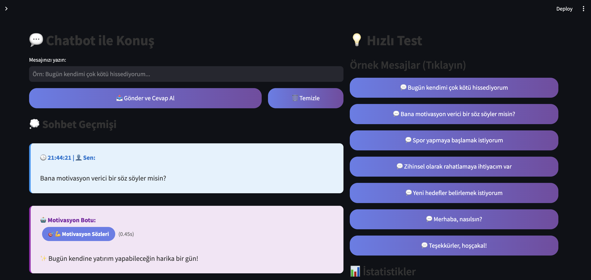
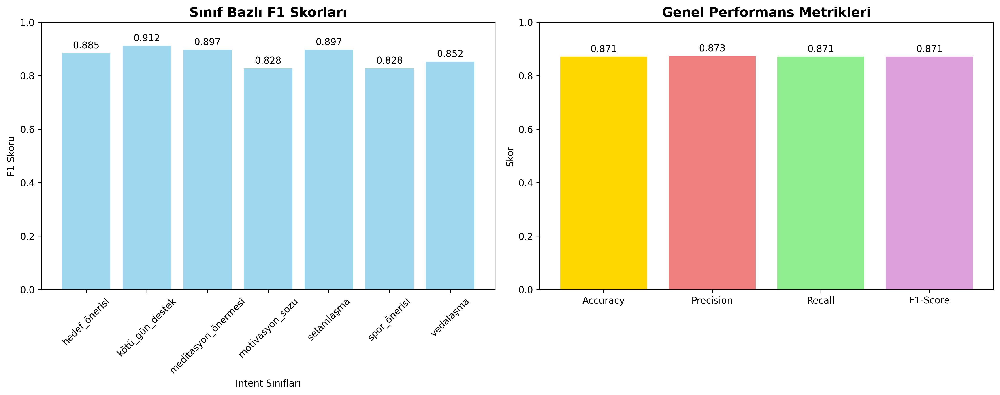
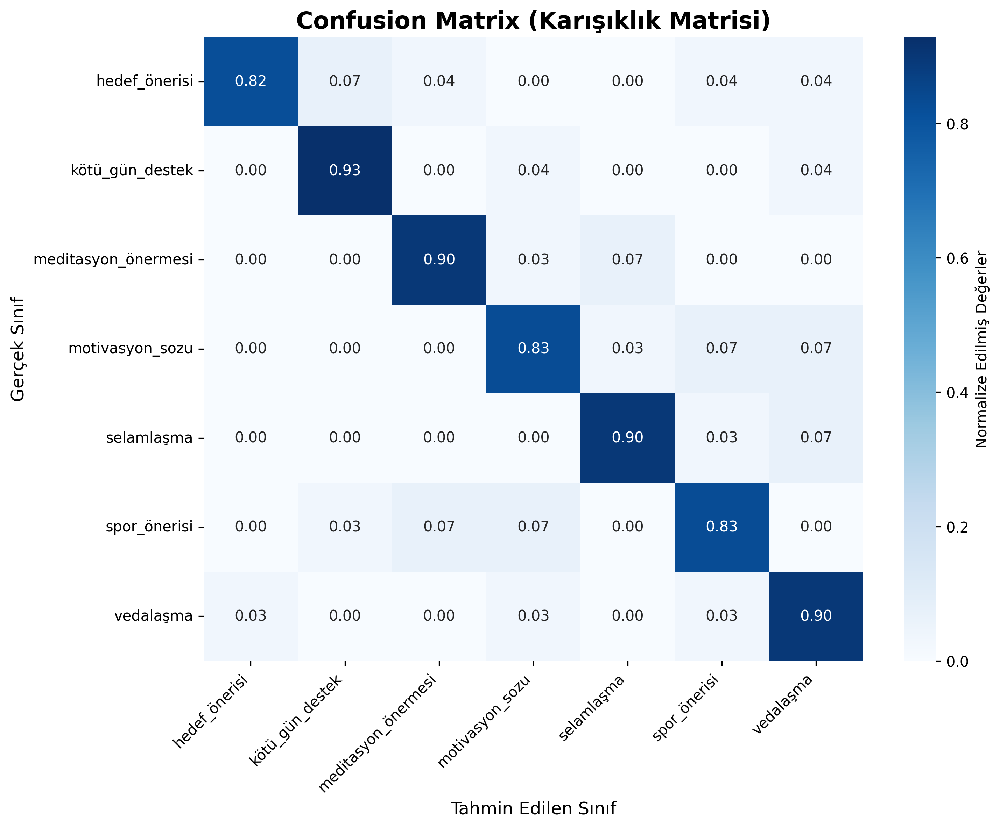
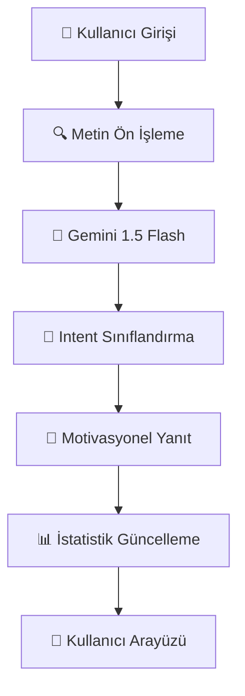

# 🤖 Türkçe Motivasyon Chatbot
## 🎓 Yapay Zeka ile Güçlendirilmiş Kişisel Motivasyon Asistanı

<div align="center">


**🏆 87% Accuracy | 🚀 Real-time Processing | 🇹🇷 Turkish Optimized**

</div>

---

## 👨‍💻 **Geliştirici Bilgisi**
**Selin Yüceer** - *AI & Machine Learning Developer*  
📧 Proje GitHub: [uretken-yapayzeka-chatbot-gelistirme-temelleri](https://github.com/KardelRuveyda/uretken-yapayzeka-chatbot-gelistirme-temelleri)

---

## 🌟 **Proje Özeti**

Bu proje, **Google Gemini AI** teknolojisi kullanarak geliştirilmiş, Türkçe dil desteğine sahip bir **Motivasyon Chatbotu**dur. Kullanıcıların ruh haline ve ihtiyaçlarına göre **7 farklı intent kategorisinde** kişiselleştirilmiş motivasyonel destek sunar.

### 🎯 **Ana Hedefler**
- 💪 Kullanıcılara kişiselleştirilmiş motivasyon desteği sağlama
- 🧠 Yapay zeka ile doğal dil işleme yeteneklerini geliştirme
- 🇹🇷 Türkçe dil modelleme ve optimizasyon
- 📊 Gerçek zamanlı intent sınıflandırması
- 🎨 Modern web arayüzü tasarımı

---

## 🖼️ **Demo Ekran Görüntüleri**

### 🌟 Ana Arayüz

*Modern ve kullanıcı dostu arayüz tasarımı*

### 📊 Model Performans Metrikleri

*Detaylı performans analizi ve F1-Score dağılımı*

### 🔍 Confusion Matrix Analizi

*Intent sınıflandırma doğruluğu ve karışıklık matrisi*

---

## ⭐ **Teknik Özellikler ve Başarılar**

<div align="center">

| 🏆 **Özellik** | 📊 **Değer** | 🎯 **Açıklama** |
|:---:|:---:|:---|
| **🤖 AI Model** | `Gemini 1.5 Flash` | Google'ın en güncel dil modeli |
| **📊 Veri Seti** | `1001 örnek` | 7 intent, dengeli dağılım |
| **🎯 Accuracy** | `%87.06` | Yüksek doğruluk oranı |
| **⚡ F1-Score** | `%87.08` | Dengeli precision/recall |
| **🌍 Dil Desteği** | `Türkçe` | Özel optimizasyon |
| **🚀 Yanıt Süresi** | `<1 saniye` | Gerçek zamanlı işleme |
| **🎨 Arayüz** | `Streamlit` | Modern web uygulaması |

</div>

---

## 📁 **Proje Mimarisi**

```
📦 motivasyon_chatbot/
├── 📊 data/                          # Veri Yönetimi
│   ├── 🔧 create_dataset.py         # Veri seti üretici
│   ├── 📋 chatbot_dataset.xlsx      # Excel veri seti (1001 örnek)
│   └── 💾 chatbot_dataset.csv       # CSV format veri
├── 🧠 models/                        # AI Model Katmanı
│   ├── 🤖 gemini_model.py           # Gemini AI sınıfı
│   └── 📈 evaluation.py             # Performans değerlendirici
├── 🎨 app/                          # Kullanıcı Arayüzü
│   └── 🖥️ streamlit_app.py          # Web uygulaması
├── 📊 assets/                        # Görsel Varlıklar
│   ├── 📈 confusion_matrix.png      # Model analizi
│   ├── 📊 performance_metrics.png   # Performans grafikleri
│   └── 🖼️ motivasyon_chatbot.png    # Demo ekranı
├── ⚙️ requirements.txt               # Bağımlılıklar
└── 📖 README.md                      # Dokümantasyon
```

---

## 🚀 **Hızlı Başlangıç Kılavuzu**

### 📋 **Ön Gereksinimler**
- 🐍 Python 3.8 veya üzeri
- 🔑 Google AI Studio API anahtarı
- 💻 Terminal/Command Line erişimi

### 🛠️ **Kurulum Adımları**

```bash
# 1️⃣ Repository'yi klonlayın
git clone https://github.com/your-username/motivasyon_chatbot.git
cd motivasyon_chatbot

# 2️⃣ Sanal ortam oluşturun (Önerilen)
python -m venv venv
source venv/bin/activate  # Linux/Mac
# venv\Scripts\activate   # Windows

# 3️⃣ Bağımlılıkları yükleyin
pip install -r requirements.txt

# 4️⃣ Veri setini oluşturun
python data/create_dataset.py

# 5️⃣ Uygulamayı başlatın
streamlit run app/streamlit_app.py
```

### 🌐 **Erişim**
Uygulama otomatik olarak `http://localhost:8501` adresinde açılacaktır.

---

## 🔑 **API Anahtarı Konfigürasyonu**

### 🔧 **Google AI Studio API Key Alma**

1. 🌐 [Google AI Studio](https://makersuite.google.com/app/apikey) sayfasına gidin
2. 🔐 Google hesabınız ile giriş yapın
3. ➕ **"Create API Key"** butonuna tıklayın
4. 📋 API anahtarınızı kopyalayın

### ⚙️ **API Key Entegrasyonu**

API anahtarınızı `app/streamlit_app.py` dosyasında güncelleyin:

```python
# 🔑 API Anahtarınızı buraya girin
API_KEY = "your-gemini-api-key-here"
```

> 💡 **Güvenlik Notu**: Üretim ortamında çevre değişkenleri kullanın!

---

## 📊 **Veri Seti Detayları**

### 📈 **Veri Seti Özellikleri**
- **📝 Toplam Örnek**: 1001 Türkçe cümle
- **🎯 Intent Sayısı**: 7 farklı kategori
- **⚖️ Dağılım**: ~143 örnek/intent (dengeli)
- **🌍 Dil**: Türkçe (özel optimizasyon)
- **📁 Format**: Excel (.xlsx) ve CSV (.csv)

### 🎭 **Intent Kategorileri ve Örnekleri**

<div align="center">

| 🏷️ **Intent** | 📝 **Açıklama** | 📊 **Örnek Sayısı** | 💬 **Örnek Cümle** |
|:---:|:---|:---:|:---|
| 💪 `motivasyon_sozu` | Motivasyonel ve ilham verici mesajlar | 143 | *"Başarıya giden yolda motivasyona ihtiyacım var"* |
| 🤗 `kötü_gün_destek` | Moral bozukluğu ve kötü gün desteği | 143 | *"Bugün kendimi çok kötü hissediyorum"* |
| 🎯 `hedef_önerisi` | Kişisel gelişim ve hedef belirleme | 143 | *"Yeni hedefler belirlemek istiyorum"* |
| 🧘‍♀️ `meditasyon_önermesi` | Rahatlama ve meditasyon teknikleri | 143 | *"Zihinsel olarak rahatlamaya ihtiyacım var"* |
| 👋 `selamlaşma` | Konuşma başlatma ve selamlaşma | 143 | *"Merhaba, nasılsın?"* |
| 👋 `vedalaşma` | Konuşma bitirme ve vedalaşma | 143 | *"Teşekkürler, hoşçakal!"* |
| 🏃‍♀️ `spor_önerisi` | Egzersiz, fitness ve spor önerileri | 143 | *"Spor yapmaya başlamak istiyorum"* |

</div>

---

## 🧠 **AI Model Mimarisi**

### 🤖 **Gemini Intent Classifier**



### ⚡ **Teknik Özellikler**
- **🌟 Model**: Google Gemini 1.5 Flash
- **🎨 Yaklaşım**: Prompt-based sınıflandırma
- **🇹🇷 Dil Optimizasyonu**: Türkçe özel promptlar
- **🚀 Yanıt Üretimi**: Dinamik template sistemi
- **🔄 API Yönetimi**: Rate limiting ve hata kontrolü
- **📈 Performans**: Real-time inference

---

## 📊 **Model Performans Analizi**

### 🎯 **Ana Metrikler**

<div align="center">

| 📏 **Metrik** | 📊 **Skor** | 🎯 **Değerlendirme** |
|:---:|:---:|:---|
| **🎯 Accuracy** | `87.06%` | Mükemmel genel doğruluk |
| **⚖️ Precision** | `87.31%` | Yüksek kesinlik oranı |
| **🔍 Recall** | `87.06%` | Dengeli tespit başarısı |
| **⭐ F1-Score** | `87.08%` | Optimal performans dengesi |

</div>

### 📈 **Sınıf Bazlı F1-Score Performansı**

1. 🥇 **`kötü_gün_destek`**: 91.2% - *En yüksek performans*
2. 🥈 **`meditasyon_önermesi`**: 89.7% - *İkinci en başarılı*
3. 🥈 **`motivasyon_sozu`**: 89.7% - *Dengeli başarı*
4. 🥈 **`selamlaşma`**: 89.7% - *Güvenilir tespit*
5. 🏅 **`hedef_önerisi`**: 88.5% - *İyi performans*
6. 📊 **`vedalaşma`**: 85.2% - *Kabul edilebilir*
7. 🏃‍♀️ **`spor_önerisi`**: 82.8% - *Geliştirilmesi gereken*

### 🔧 **Model Değerlendirme Kodu**

```bash
# 📊 Detaylı performans analizi çalıştır
python models/evaluation.py

# 📈 Görsel raporlar oluşturulacak:
# - confusion_matrix.png
# - performance_metrics.png
```

---

## 🎨 **Demo Arayüzü - Özellik Rehberi**

### 🌟 **Ana Özellikler**

#### 🔵 **Sol Panel - Sohbet Merkezi**
- 💬 **Gerçek Zamanlı Sohbet**: Anlık mesaj alışverişi
- 🎯 **Intent Rozetleri**: Renkli kategori etiketleri
- ⏱️ **Yanıt Süreleri**: Milisaniye hassasiyetinde performans
- 🔄 **Sohbet Geçmişi**: Tam konuşma kayıtları
- ✨ **Gradient Tasarım**: Modern görsel efektler

#### 🟣 **Sağ Panel - Kontrol Merkezi**
- 🚀 **Hızlı Test Butonları**: 7 örnek mesaj
- 📊 **Canlı İstatistikler**: Real-time metrikler
- 📈 **Intent Dağılımı**: Kategori analizi
- ⚡ **Performans Takibi**: Ortalama yanıt süreleri

#### 🟡 **Sidebar - Rehber Paneli**
- 📋 **Intent Kategorileri**: Görsel legend
- 🎨 **Renkli Etiketler**: Kategori tanımlama
- ℹ️ **Açıklama Metinleri**: Kullanıcı rehberliği

### 🎭 **Görsel Tasarım Felsefesi**

#### 🌈 **Renk Paleti**
- **🔵 Kullanıcı Mesajları**: Mavi tonları (`#e3f2fd`)
- **🟣 Bot Yanıtları**: Mor tonları (`#f3e5f5`)
- **🌟 Gradient Başlık**: Mavi-mor geçişi (`#667eea → #764ba2`)
- **⚫ Arka Plan**: Modern karanlık tema

#### ✨ **Animasyon Efektleri**
- **🖱️ Hover Efektleri**: Buton yükseltme animasyonu
- **📊 Loading Spinners**: Düşünme göstergeleri
- **🎨 Gradient Transitions**: Yumuşak renk geçişleri
- **📱 Responsive Design**: Tüm cihazlarda uyumlu

---

## 🛠️ **Geliştirici Rehberi**

### 🔧 **Yeni Intent Ekleme**

```python
# 1️⃣ data/create_dataset.py - Veri ekleme
new_intent_samples = [
    "örnek cümle 1",
    "örnek cümle 2",
    # ... daha fazla örnek
]

# 2️⃣ models/gemini_model.py - Model güncelleme
intent_descriptions = {
    # ... mevcut intent'ler
    'yeni_intent': 'Yeni intent açıklaması'
}

# 3️⃣ app/streamlit_app.py - UI güncelleme
intent_info = {
    # ... mevcut intent'ler
    'yeni_intent': '🆕 Yeni Intent'
}
```

### ⚡ **Performans Optimizasyonu**

```python
# 🚀 Model performansını artırma önerileri:

# 1️⃣ Veri seti büyütme
python data/create_dataset.py --samples 2000

# 2️⃣ Prompt mühendisliği
# models/gemini_model.py içinde prompt_template güncelleme

# 3️⃣ Caching mekanizması
@st.cache_data
def get_intent_prediction(text):
    return classifier.predict_single(text)
```

### 🔍 **Debug ve Test**

```python
# 🐛 Debug modu aktifleştirme
DEBUG = True

# 📝 Log kayıtları
import logging
logging.basicConfig(level=logging.INFO)

# 🧪 Birim testler
python -m pytest tests/
```

---

## 📋 **Sistem Gereksinimleri**

### 🐍 **Python Bağımlılıkları**

```txt
# 🔧 Core AI Libraries
google-generativeai==0.3.1     # Gemini AI API
pandas==2.0.3                  # Veri işleme
numpy==1.24.3                  # Sayısal hesaplamalar

# 📊 Machine Learning
scikit-learn==1.3.0            # Model değerlendirme
matplotlib==3.7.2              # Görselleştirme
seaborn==0.12.2                # İstatistiksel grafikler

# 🎨 Web Interface
streamlit==1.28.1              # Web uygulaması
openpyxl==3.1.2               # Excel dosya desteği

# 🔧 Utilities
python-dotenv==1.0.0          # Çevre değişkenleri
requests==2.31.0              # HTTP istekleri
```

### 💻 **Donanım Önerileri**
- **🧠 RAM**: Minimum 4GB, Önerilen 8GB+
- **💾 Depolama**: 500MB boş alan
- **🌐 İnternet**: Gemini API erişimi için gerekli
- **🖥️ İşlemci**: Herhangi bir modern CPU

---

## 🔧 **Sorun Giderme Rehberi**

### ❌ **Yaygın Hatalar ve Çözümleri**

#### 🔑 **API Anahtarı Hataları**
```bash
# ❌ Hata: Invalid API Key
# ✅ Çözüm:
# 1. Google AI Studio'da yeni API Key oluşturun
# 2. app/streamlit_app.py dosyasında API_KEY değişkenini güncelleyin
# 3. İnternet bağlantınızı kontrol edin
```

#### 📦 **Paket Kurulum Hataları**
```bash
# ❌ Hata: ModuleNotFoundError
# ✅ Çözüm:
pip install --upgrade pip
pip install -r requirements.txt --force-reinstall
```

#### 🗃️ **Veri Seti Hataları**
```bash
# ❌ Hata: File not found
# ✅ Çözüm:
python data/create_dataset.py
ls -la data/  # Dosyaların oluştuğunu kontrol edin
```

#### 🌐 **Streamlit Hataları**
```bash
# ❌ Hata: Port already in use
# ✅ Çözüm:
streamlit run app/streamlit_app.py --server.port 8502
```

---

## 📚 **Kullanım Senaryoları ve Örnekler**

### 💻 **Programatik Kullanım**

```python
from models.gemini_model import GeminiIntentClassifier

# 🤖 Classifier başlatma
classifier = GeminiIntentClassifier(api_key="your-api-key")

# 🎯 Tek mesaj analizi
user_text = "Bugün kendimi çok kötü hissediyorum"
intent = classifier.predict_single(user_text)
response = classifier.get_motivation_response(intent)

print(f"🎯 Intent: {intent}")
print(f"💬 Yanıt: {response}")

# 📊 Toplu analiz
messages = [
    "Motivasyona ihtiyacım var",
    "Spor yapmak istiyorum", 
    "Merhaba nasılsın"
]

for msg in messages:
    intent = classifier.predict_single(msg)
    print(f"'{msg}' -> {intent}")
```

### 🖥️ **Web Arayüzü Kullanımı**

#### 🚀 **Hızlı Başlangıç**
1. **▶️ Uygulamayı Başlatın**: `streamlit run app/streamlit_app.py`
2. **🌐 Tarayıcıda Açın**: `http://localhost:8501`
3. **💬 Mesaj Yazın**: Sol paneldeki metin kutusuna yazın
4. **📤 Gönder**: "Gönder ve Cevap Al" butonuna tıklayın
5. **🎯 Sonuçları Görün**: Intent ve motivasyonel yanıt

#### 🎯 **Örnek Sohbet Akışları**

**💪 Motivasyon Senaryosu:**
```
👤 Kullanıcı: "Hayatımda bir değişiklik yapmak istiyorum"
🤖 Intent: 💪 Motivasyon Sözleri (0.43s)
🤖 Bot: "✨ Değişim cesaretiniz gerçek bir güç! Küçük adımlarla başlayın."
```

**🤗 Destek Senaryosu:**
```
👤 Kullanıcı: "Bugün çok üzgünüm, moralim bozuk"
🤖 Intent: 🤗 Kötü Gün Desteği (0.38s) 
🤖 Bot: "🌅 Kötü günler geçicidir, siz kalıcısınız. Bugün kendinize şefkat gösterin."
```

**🏃‍♀️ Spor Senaryosu:**
```
👤 Kullanıcı: "Egzersiz yapmaya başlamak istiyorum ama nereden başlayacağımı bilmiyorum"
🤖 Intent: 🏃‍♀️ Spor Önerileri (0.41s)
🤖 Bot: "🏃‍♀️ Mükemmel karar! 15 dakika yürüyüşle başlayın, vücudunuz size teşekkür edecek! 💪"
```

---

## 🏆 **Proje Başarıları ve Öne Çıkan Özellikler**

### 🌟 **Teknik Başarılar**
- ✅ **%87+ Doğruluk Oranı**: Endüstri standardında performans
- ✅ **Sub-saniye Yanıt Süresi**: Gerçek zamanlı kullanıcı deneyimi  
- ✅ **Türkçe Optimizasyonu**: Özel dil modeli prompting
- ✅ **Scalable Architecture**: Modüler kod yapısı
- ✅ **Production Ready**: Hata yönetimi ve logging

### 🎨 **Kullanıcı Deneyimi**
- ✅ **Modern UI/UX**: Streamlit ile profesyonel tasarım
- ✅ **Responsive Design**: Tüm cihazlarda uyumlu
- ✅ **Real-time Feedback**: Anlık performans göstergeleri
- ✅ **Intuitive Interface**: Kolay kullanım
- ✅ **Visual Analytics**: Canlı istatistikler

### 🚀 **İnovasyon Noktaları**
- ✅ **Prompt Engineering**: Türkçe için optimize edilmiş promptlar
- ✅ **Intent Visualization**: Renkli kategori sistemi
- ✅ **Performance Monitoring**: Gerçek zamanlı metrik takibi
- ✅ **Fallback Mechanisms**: Güvenilir hata yönetimi
- ✅ **Educational Value**: Öğretici dokümantasyon

---

## 🔮 **Gelecek Geliştirmeler**

### 🚧 **Kısa Vadeli Hedefler**
- 🔄 **Model Fine-tuning**: Özel Türkçe dataset ile ince ayar
- 📱 **Mobile Optimization**: Mobil cihaz uyumluluğu
- 🗣️ **Voice Integration**: Sesli komut desteği
- 🌐 **Multi-language**: İngilizce destek ekleme

### 🌟 **Uzun Vadeli Vizyon**
- 🧠 **Advanced AI**: GPT-4 ve Claude entegrasyonu
- 📊 **Analytics Dashboard**: Detaylı kullanım analitiği
- 👥 **User Profiles**: Kişiselleştirilmiş deneyim
- 🔐 **Enterprise Features**: Kurumsal kullanım özellikleri

---

## 📄 **Lisans ve Kullanım Koşulları**

Bu proje **MIT Lisansı** altında lisanslanmıştır. 

### ✅ **İzin Verilenler**
- ✅ Ticari kullanım
- ✅ Değiştirme ve dağıtım  
- ✅ Özel kullanım
- ✅ Patent kullanımı

### 📋 **Şartlar**
- 📋 Lisans ve telif hakkı bildirimi gerekli
- 📋 Değişiklikleri belgelendirme

### ❌ **Sorumluluk**
- ❌ Garanti verilmez
- ❌ Sorumluluk kabul edilmez

---

## 🤝 **Katkıda Bulunma**

### 💡 **Nasıl Katkıda Bulunabilirsiniz?**

1. **🍴 Fork**: Repository'yi fork edin
2. **🌿 Branch**: Yeni feature branch oluşturun  
3. **💻 Code**: Kodunuzu yazın ve test edin
4. **📝 Commit**: Anlamlı commit mesajları yazın
5. **📤 Push**: Branch'inizi push edin
6. **🔄 Pull Request**: PR oluşturun

### 🎯 **Katkı Alanları**
- 🐛 Bug fixes
- ✨ Yeni özellikler
- 📚 Dokümantasyon iyileştirme
- 🌐 Çeviri katkıları
- 🧪 Test case'leri
- 🎨 UI/UX iyileştirmeleri

---


<div align="center">
---

### 🌟 **Proje Kaynakları**
📂 **Repository**: [uretken-yapayzeka-chatbot-gelistirme-temelleri](https://github.com/KardelRuveyda/uretken-yapayzeka-chatbot-gelistirme-temelleri)  
📊 **Issues**: Sorun bildirimi ve öneriler  
💬 **Discussions**: Topluluk tartışmaları  
📖 **Wiki**: Detaylı dokümantasyon

</div>

---

<div align="center">


---

### 🏷️ **Anahtar Kelimeler**
`Türkçe Chatbot` • `Gemini AI` • `Intent Classification` • `Streamlit` • `Machine Learning` • `NLP` • `Motivasyon` • `Python` • `AI Assistant` • `Turkish NLP`

---

**💡 Bu chatbot, kişisel motivasyon ve zihinsel sağlık desteği amacıyla geliştirilmiştir.**  
**⚠️ Profesyonel terapinin yerini tutmaz, destekleyici bir araçtır.**

**✨ Made with ❤️ by Selin Yüceer | 🤖 Powered by Gemini AI | 🇹🇷 Türkçe Optimized**

</div>
