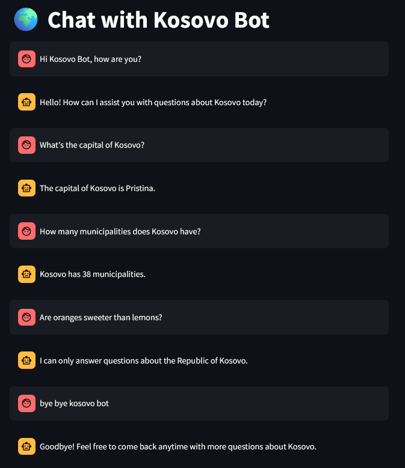
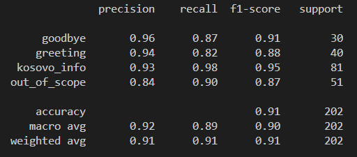

# 🇽🇰 Kosovo Chatbot

A conversational assistant powered by **Google Gemini**, a **custom-trained intent classifier**, and a **Retrieval-Augmented Generation (RAG)** pipeline using **Hugging Face embeddings** and **Chroma vector store**. It answers questions only about the **Republic of Kosovo**, greets users, says goodbye, and gracefully handles unrelated queries.

---

## 🚀 Setup Instructions

1. **Create a virtual environment**
   ```bash
   python -m venv venv
   ```

2. **Activate the virtual environment**
   - On **Windows**:
     ```bash
     venv\Scripts\activate
     ```
   - On **macOS/Linux**:
     ```bash
     source venv/bin/activate
     ```

3. **Install dependencies**
   ```bash
   pip install -r requirements.txt
   ```

4. **Set your Gemini API key**
   Create a `.env` file in the project root and add:
   ```
   GEMINI_API_KEY=[YOUR_API_KEY_HERE]
   ```

5. **Train the intent classifier**
   ```bash
   python models/train_intent_classifier.py
   ```

6. *(Optional)* Evaluate the classifier
   ```bash
   python models/classifier_stats.py
   ```

7. **Generate the vector store**
   This builds the Chroma database from Kosovo-related documents.
   ```bash
   python chroma/create_vector_store.py
   ```

8. **Run the chatbot**
   ```bash
   streamlit run --server.fileWatcherType=none app/streamlit_app.py
   ```

---

## ✨ Features

- 🧠 Intent classification with ~94% accuracy
- 🌍 Kosovo-specific Q&A powered by Gemini + RAG
- 🙋 Natural greeting and goodbye responses
- 🚫 Graceful handling of out-of-scope queries
- ⚡ Fast and lightweight with HuggingFace + Chroma

---

## 📁 Project Structure

```
kosovo_chatbot/
├── app/
│   └── streamlit_app.py             # Main Streamlit chatbot app
├── chroma/
│   └── create_vector_store.py       # Script to create Chroma vector store
├── data/
│   ├── chroma_store/                # Persisted vector store
│   ├── chatbot_dataset.csv          # Intent classification dataset
│   ├── kosovo_demographics.txt      # Knowledge base documents
│   ├── kosovo_economy.txt
│   ├── kosovo_facts.txt
│   ├── kosovo_geography.txt
│   └── kosovo_history.txt
├── images/
│   ├── demo_image.png
│   └── classifier_stats.png
├── models/
│   ├── intent_classifier.joblib     # Trained intent classifier
│   ├── train_intent_classifier.py
│   └── classifier_stats.py
├── .env                             # API key goes here
├── .gitignore
├── LICENSE
├── README.md
└── requirements.txt
```

---

## 🤖 Why Gemini + RAG?

While Gemini provides high-quality, general-purpose text generation, combining it with a **Retrieval-Augmented Generation (RAG)** pipeline allows the chatbot to:
- Answer using **grounded facts** from Kosovo-specific documents
- Avoid hallucinations or unrelated content
- Remain **efficient and scalable** for real-time Q&A tasks

---

## 🖼️ Demo



---

## 📊 Classifier Stats



---

## 📜 License

MIT License

---

## 🙌 Contributions

Issues and pull requests are welcome! Let’s build a better Kosovo chatbot together 🇽🇰
